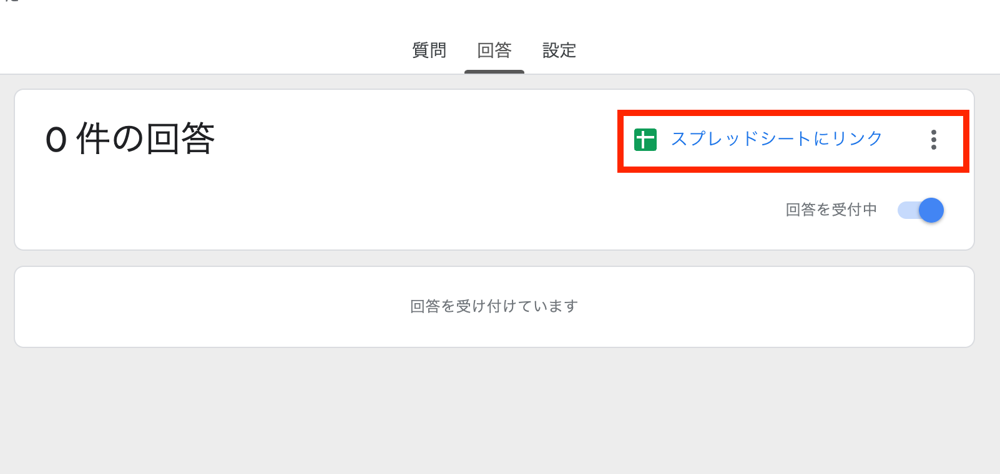
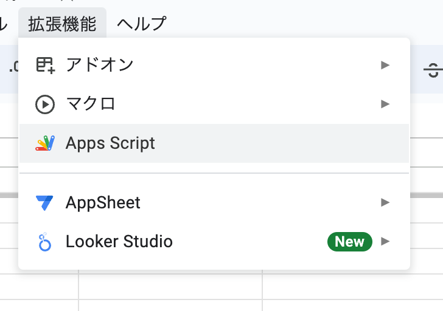
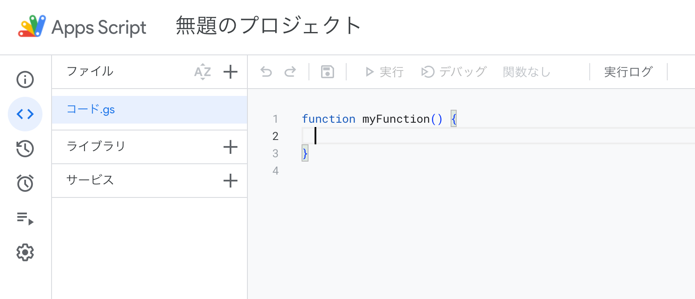
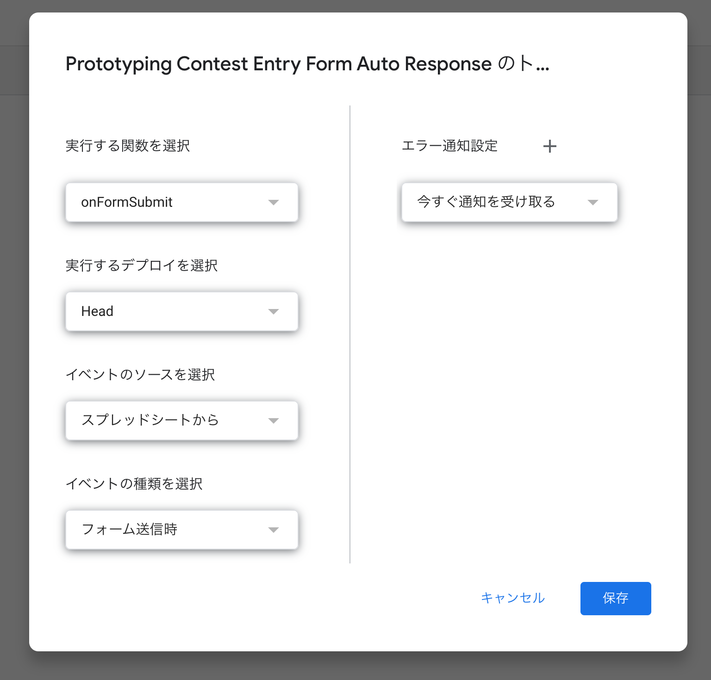
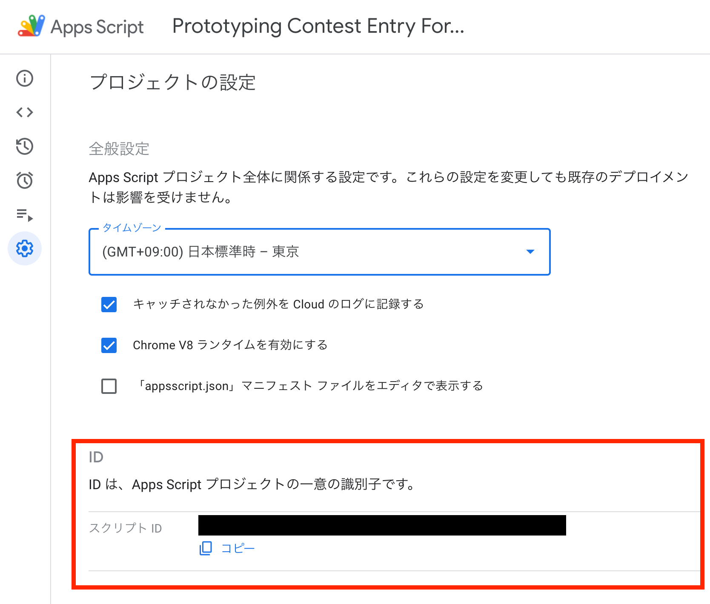

# GAS-AUTO-RESPONSE-EMAIL

Google FormでSubmit時に、回答者に自動返信するスクリプトです。

## 注意事項

from で指定されるメールアドレスは、実在する Google アカウントでなければなりません。
また、送信先のメールアドレスや本文に入れ込むユーザー名は、それぞれ「メールアドレス」「お名前」というラベルのフィールドが入るようになっています。


## Google Form / SpreadSheetへの設定方法

### Apps Scriptの準備

1. Google Formの回答タブで、回答をスプレッドシートにリンクする


2. SpreadSheetのメニューから「拡張機能」 > 「App Script」と選択する


3. App Scriptのプロジェクト名を変更する
(初期状態では「無題のプロジェクト」となっているので、適当な名前にする)



## 2. Apps Scriptを編集

Apps Script のコード部分に、以下のソースコードを貼り付けます。
送信元メールアドレス、送信元表示名、件名、メール本文は適宜書き換えてください。

./src/mailTemplate.js  
```
/**
 * 送信メールのテンプレート
 */

// メール設定
const Options = {
  from: 'example@gmail.com',      // 送信元メールアドレス(必須)
  name: '〇〇事務局',      　　　　　// 送信元表示名(必須)
  replyTo: 'example@gmail.com',   // 返信先メールアドレス(任意)
  cc: '',                         // CCメールアドレス(任意)
  bcc: '',                        // BCCメールアドレス(任意)
};

// 送信メールの件名
const MailSubject = `メールの件名`

// 送信メールの本文
const MailBody = (customerName) => (`
  ${customerName} 様

  メール本文

  メール本文

  メール本文

`);
```


./src/main.js  
```
/**
 * フォームに回答時のイベントを処理する関数
 */
function onFormSubmit(evt) {

  // フォームから入力されたメールアドレス、氏名を取得
  const email = evt.namedValue['メールアドレス'][0];
  const name = evt.namedValue['お名前'][0];

  // メール送信
  GmailApp.sendEmail(email, MailSubject, MailBody(name), Options);
}
```

## トリガーを設定

Apps Scriptの左側メニューから「トリガー」を選択し、
下記の設定でトリガーを作成してください。



## 【開発者向け】 環境構築

### claspをインストール
```
yarn global add @google/clasp
```

### claspでGoogleログイン
```
clasp login
```

### .clasp.jsonを作成
`template.clasp.json` をコピーして　`.clasp.json` にリネームし、
`scriptId` を書き換える

`scriptId` はApp Scriptの左側画面の




### `mailTemplate.js` を編集

件名、本文を編集する
デフォルトで、フォーム投稿者が入力した `お名前` が入るようになっている。


### デプロイ

変更したコードをApp Scriptに反映する
```
clasp push
```
